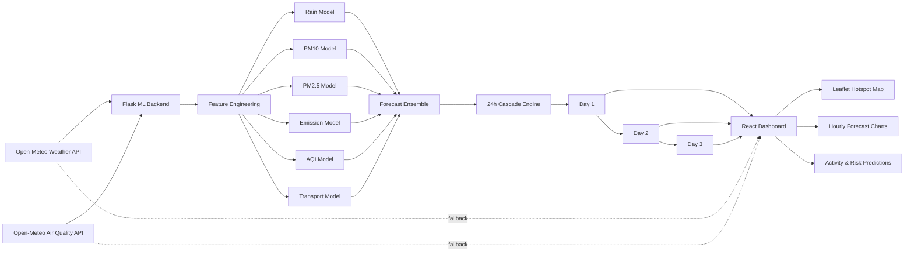

<div align="center">

# 🌫️ Vatavarnam

### 72-Hour AQI Forecasting & Atmospheric Intelligence for Delhi NCR

**A Smart India Hackathon 2026 inspired ML system for forecasting air quality by combining pollution history, live meteorology, engineered atmospheric features, and spatial hotspot intelligence.**

<br/>

[](https://react.dev/)
[](https://vite.dev/)
[](https://flask.palletsprojects.com/)
[](https://scikit-learn.org/)
[](https://leafletjs.com/)
[](LICENSE)

<br/>

> 🌐 **Live Deployment:** [https://vatavarnam-1.onrender.com/](https://vatavarnam-1.onrender.com/)

</div>

---

## 🌍 What is Vatavarnam?

**Vatavarnam** is a machine-learning powered environmental forecasting dashboard built around **Smart India Hackathon 2026 Problem Statement SIH26082 — “Air Pollution–Weather Coupled Forecasting System (Delhi NCR Focus)”**, issued by the **Ministry of Earth Sciences (MoES)**.

The core problem is simple to state but difficult to model:

> Delhi's air pollution is strongly affected by weather, while dense pollution itself can also influence local atmospheric conditions.

Temperature, wind, humidity, pressure, radiation, atmospheric stagnation and historical pollutant concentration can all influence whether pollution disperses or remains trapped near the surface.

Vatavarnam approaches this challenge as a practical ML forecasting system that produces a **72-hour outlook for Delhi NCR**, divided into three cascading 24-hour forecast windows.

---

## 🎯 Project Goal

The system is designed to answer three questions:

1. **What will Delhi NCR's air quality look like over the next 72 hours?**
2. **Which atmospheric and pollution conditions are driving the forecast?**
3. **Where are pollution hotspots likely to be most severe?**

Alongside AQI forecasting, the dashboard also converts atmospheric conditions into useful decision-support indicators such as walking suitability, visibility, long-drive conditions, respiratory risk and operational disruption.

---

## ✨ Key Features

- 🔮 **72-hour AQI forecasting** through Day 1, Day 2 and Day 3 forecast windows
- 🌡️ **Live meteorological input** from Open-Meteo
- 🌫️ **PM2.5 and PM10 forecasting**
- 🧠 **Multi-model ML ensemble** instead of relying on a single algorithm
- 🔁 **Cascade forecasting**, where previous predicted pollution values seed future horizons
- 📉 **Hourly AQI forecast charts**
- 🗺️ **Interactive Delhi NCR hotspot map**
- 📍 **30+ pollution hotspot locations** with severity visualization
- 🧪 **Engineered atmospheric features** such as stagnation, inversion and smog proxies
- 🏃 **Activity suitability predictions**
- 🫁 **Respiratory / asthma risk indication**
- ✈️ **Flight-delay risk estimation**
- 👁️ **Visibility prediction**
- 🚗 **Long-drive suitability**
- 📦 **Shipment safety estimation**
- 🔄 **Automatic forecast refresh**
- 🛟 **Client-side fallback forecasting** when the Python ML backend is unavailable

---

## 🧠 ML Forecasting Layer

Vatavarnam loads trained model artifacts using `joblib` and runs dedicated models for different forecast targets.

| Forecast Target | Model |
|---|---|
| Rain Probability | Calibrated Logistic Regression |
| PM10 | Gradient Boosting Regressor |
| PM2.5 | Extra Trees Regressor |
| Fume Emissions | Random Forest Regressor |
| AQI Index | MLP Neural Network |
| Transportation Impact | Support Vector Regressor |

The backend also contains a second prediction layer for activity and operational conditions such as:

`Walking` · `Outing` · `Visibility` · `Long Drive` · `Shipment Safety` · `Asthma Risk` · `Flight Delay`

---

## 🌡️ Feature Engineering

Rather than feeding only raw weather variables into the models, Vatavarnam constructs a richer atmospheric feature space.

### Meteorological Features

- Temperature
- Relative humidity
- Wind speed
- Surface pressure
- Solar radiation
- Rainfall / precipitation
- Dew point

### Time & Human Activity Features

- Hour-of-day cyclic encoding
- Day-of-week cyclic encoding
- Month cyclic encoding
- Weekend indicator
- Rush-hour indicator

### Pollution Memory

Historical pollution is introduced through lagged features:

- PM2.5 lag: `1h`, `24h`, `48h`
- PM10 lag: `1h`, `24h`, `48h`
- AQI lag: `1h`, `24h`, `48h`
- PM2.5 rolling averages
- PM10 rolling averages

### Atmospheric Interaction Proxies

The current prototype also derives:

- **Stagnation Index**
- **Inversion Proxy**
- **Smog Formation Factor**
- **Rain Washout Proxy**
- **Temperature-Humidity Index**

These engineered variables allow the ML models to capture more of the relationship between weather and pollutant accumulation than a simple AQI-only time series.

---

## 🔁 72-Hour Cascade Forecast

Vatavarnam forecasts three sequential 24-hour windows.

```text
Current Air Quality + Live Weather
               │
               ▼
        ┌─────────────┐
        │   Day 1     │
        │   0–24 h    │
        └──────┬──────┘
               │ predicted AQI / PM values
               ▼
        ┌─────────────┐
        │   Day 2     │
        │  24–48 h    │
        └──────┬──────┘
               │ predicted AQI / PM values
               ▼
        ┌─────────────┐
        │   Day 3     │
        │  48–72 h    │
        └─────────────┘
```

For **Day 1**, recent observed pollution values seed the lag features.

For **Day 2**, Day 1 predictions are reused as part of the next forecast state.

For **Day 3**, Day 2 predictions continue the cascade.

This gives the application a continuous **72-hour prediction horizon** rather than three unrelated daily estimates.

---

## 🏗️ System Architecture



---

## 🗺️ Delhi NCR Hotspot Intelligence

The forecast engine generates spatial AQI estimates for **30+ Delhi NCR locations**.

The frontend visualizes these locations using **React Leaflet** and an interactive dark map.

Hotspots are grouped into AQI severity classes such as:

- 🟢 Moderate
- 🟡 Poor
- 🟠 Very Poor
- 🔴 Severe

The map can expand into a full-screen view and displays the predicted AQI and severity for each location.

---

## 📡 Live Data Sources

Vatavarnam currently uses **Open-Meteo** for live and forecast atmospheric data.

### Weather

The backend consumes hourly forecasts including:

- Temperature
- Relative humidity
- Surface pressure
- Wind speed
- Precipitation
- Shortwave radiation

### Air Quality

Recent PM2.5, PM10 and AQI observations are used to seed the first prediction horizon and construct pollution lag features.

---

## 🧩 Backend API

The Flask backend exposes endpoints used by the React dashboard.

| Endpoint | Purpose |
|---|---|
| `GET /api/health` | Backend/model health information |
| `GET /api/model/metrics` | Model metrics, correlations and feature metadata |
| `GET /api/forecast/day1` | 0–24 hour forecast |
| `GET /api/forecast/day2` | 24–48 hour forecast |
| `GET /api/forecast/day3` | 48–72 hour forecast |
| `GET /api/activity/predictions` | Activity and operational risk predictions |

Forecast responses can include:

- model outputs
- hourly chart data
- prediction horizon
- Delhi NCR hotspot estimates
- active forecast source

---

## 🛠️ Tech Stack

### Frontend

- React
- Vite
- React Router
- React Leaflet
- Leaflet
- CSS
- OpenStreetMap / CARTO map tiles

### Backend & ML

- Python
- Flask
- Flask-CORS
- NumPy
- pandas
- scikit-learn
- joblib
- Requests

### External Data

- Open-Meteo Weather API
- Open-Meteo Air Quality API

---

## 📁 Project Structure

```text
Vatavarnam/
│
├── backend/
│   ├── app.py
│   ├── requirements.txt
│   └── artifacts/
│       ├── model_*.joblib
│       ├── model_metrics.json
│       ├── activity_metrics.json
│       ├── correlations.json
│       └── feature_names.json
│
├── public/
│
├── src/
│   ├── components/
│   │   ├── dashboard/
│   │   ├── common/
│   │   └── map/
│   │
│   ├── data/
│   ├── hooks/
│   │   └── useForecastData.js
│   │
│   ├── layouts/
│   ├── pages/
│   │   ├── Meteorology.jsx
│   │   ├── Forecast.jsx
│   │   ├── Forecast2.jsx
│   │   ├── Forecast3.jsx
│   │   └── Home.jsx
│   │
│   ├── styles/
│   ├── App.jsx
│   └── main.jsx
│
├── index.html
├── package.json
├── vite.config.js
└── README.md
```

---

## 🚀 Running Locally

### Prerequisites

Make sure you have:

- **Python 3.10+**
- **Node.js 18+**
- **npm**
- Git

### 1. Clone the repository

```bash
git clone https://github.com/yupitsmegd7/Vatavarnam.git
cd Vatavarnam
```

### 2. Start the ML backend

Create and activate a virtual environment:

```bash
python -m venv .venv
```

**Windows**

```bash
.venv\Scripts\activate
```

**Linux / macOS**

```bash
source .venv/bin/activate
```

Install backend dependencies:

```bash
pip install -r backend/requirements.txt
pip install requests
```

Start Flask:

```bash
python backend/app.py
```

The backend runs locally at:

```text
http://127.0.0.1:5000
```

### 3. Start the frontend

Open another terminal:

```bash
npm install
npm run dev
```

The Vite frontend will normally be available at:

```text
http://localhost:5173
```

The frontend expects `/api` requests to be proxied to the Flask backend running on port `5000`.

---

## 🧪 Forecast Flow

```text
Open-Meteo Weather + Air Quality
              ↓
      Atmospheric Features
              ↓
      Pollution Lag Features
              ↓
       Trained ML Models
              ↓
      Multi-Target Forecast
              ↓
   Hourly AQI / PM Predictions
              ↓
        72-Hour Cascade
              ↓
     Delhi NCR Hotspot Layer
              ↓
      React + Leaflet Dashboard
```

---

## 🏆 Smart India Hackathon Context

**Problem Statement:** `SIH26082`  
**Title:** Air Pollution–Weather Coupled Forecasting System (Delhi NCR Focus)  
**Organization:** Ministry of Earth Sciences (MoES)  
**Department:** National Centre for Medium Range Weather Forecasting (NCMRWF)  
**Category:** Software  

The original SIH challenge calls for a high-resolution system capable of forecasting Delhi NCR air quality for the next **72 hours** while accounting for meteorology-pollution interaction.

Vatavarnam is an **ML-based prototype inspired by that challenge**.

The current repository models coupling through live weather observations, pollution history, lagged variables and engineered atmospheric interaction proxies. It should therefore be understood as a practical ML prototype rather than a full numerical weather-chemistry implementation such as WRF-Chem.

---

## 🔭 Future Scope

Possible extensions include:

- Ground-level **O₃ and NOx forecasting**
- Direct **PBL height** and inversion-layer observations
- Stubble-burning fire detections from satellite feeds
- Wind-vector based plume transport modelling
- CPCB station-level observation ingestion
- Spatial interpolation between monitoring stations
- WRF-Chem / chemical transport model integration
- Uncertainty intervals for AQI forecasts
- Model explainability using SHAP
- Automated model retraining
- Historical forecast-vs-observation evaluation
- Mobile alerts for high-risk pollution windows

---

## ⚠️ Disclaimer

Vatavarnam is an academic / hackathon prototype and should not be treated as an official public-health, aviation or regulatory forecasting service.

Predictions depend on external APIs, trained model artifacts and the quality of the available input data.

---

## 📜 License

This project is licensed under the **MIT License**. See [`LICENSE`](LICENSE) for details.

---

<div align="center">

### 🌱 Forecasting cleaner decisions, one atmosphere at a time.

**Vatavarnam — Delhi NCR Air Quality Intelligence**

</div>
